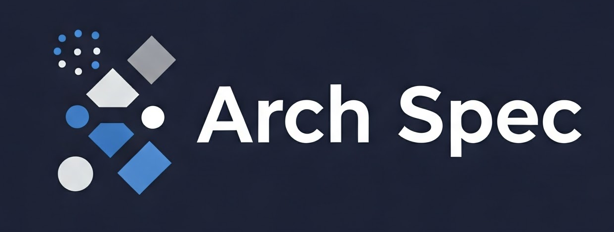

  

# ArchSpec - Early Access / Open Source Release

ArchSpec is an AI-powered software specification system that transforms the software development process by creating comprehensive, implementation-ready specifications before any code is written.

## Project Status

ArchSpec is currently in **early access**. The core functionality is working, while more advanced features are under active development.

### What's Working Now

- ✅ User signup and authentication
- ✅ Project management (create/update/delete)
- ✅ All major specification sections:
  - Requirements
  - Features
  - Pages/UI
  - Data Model
  - API Endpoints
  - Test Cases
- ✅ Preview and file export (markdown) of each specs section
- ✅ Download All (zip) of complete specifications
- ✅ One project template (more coming soon)
- ✅ Manual data entry for all specification sections
- ✅ LemonSqueezy payment integration
- ✅ AI credit-based enhancement plan

### In Development

- ⏳ Optimized AI calls (batching) for efficiency and error handling
- ⏳ Intelligent knowledge graphs for "gaps" detection
- ⏳ Implementation sequence generator
- ⏳ Additional project templates

## How to Use ArchSpec

ArchSpec streamlines the process of creating comprehensive software specifications before writing any code. Here's how to use it:

### 1. Dashboard Overview

After logging in, you'll be presented with a dashboard showing:
- Quick stats about your projects and available templates
- Recommended templates for different types of applications
- Your recently created projects
- Quick access buttons to create new projects or browse templates

### 2. Creating a New Project

1. **Start a New Project**: Click the "New Project" button from the dashboard.

2. **Choose a Starting Point**:
   - **From Template**: Select from pre-built application templates (web apps, mobile apps, etc.)
   - **Blank Project**: Start from scratch with a clean slate

3. **Define Project Basics** (Required):
   - Project name
   - Description
   - Goals and objectives
   - Target audience

4. **Build Your Specification**: Once you've saved the project basics, you can define all aspects of your application:

   - **Requirements**: Define functional and non-functional requirements
   - **Features**: Outline core modules and functionality
   - **UI Design**: Specify design system, color palette, and typography
   - **Tech Stack**: Define frontend, backend, database technologies
   - **Pages**: Design the navigation structure and page layouts
   - **Data Model**: Define entities, relationships, and database schema
   - **API Endpoints**: Document REST/GraphQL endpoints with parameters
   - **Test Cases**: Create Gherkin-style test scenarios
   - **Implementation Prompts**: Define prompts for AI-assisted implementation

   *Note: Each section can be expanded/collapsed as needed, and you can complete them in any order.*

### 3. Using Templates

Templates provide pre-configured specifications for common application types:

1. Browse available templates from the dashboard or templates page
2. Preview template details including tech stack and features
3. Select "Use This Template" to create a new project with pre-filled specifications
4. Customize any aspect of the template to match your specific needs

### 4. Exporting Specifications

After defining your specifications:

1. Navigate to your project details
2. Export individual sections as Markdown files
3. Or download the complete specification as a ZIP archive
4. Use the exported specifications to guide your development process

### 5. Project Management

From the dashboard, you can:
- View all your existing projects
- Resume work on partially completed specifications
- Update existing specifications as requirements evolve
- Duplicate projects to create variations
- Delete projects you no longer need

## Try ArchSpec

There are two ways to use ArchSpec:

### 1. Hosted Early Access

[Sign up at archspec.dev](https://archspec.dev/register) to use the hosted version without any setup.

- Basic features available for free
- Subscribe to access AI-powered features
- Be among the first to try new features

### 2. Self-Hosted Open Source

Clone and self-host the application with complete control over your data.

- Full customization options
- Unlimited projects and specifications
- Requires your own AI API keys for AI features
- Self-hosting instructions available below

## Core Principles

- **Complete Specification**: Define all aspects of software before implementation
- **Implementation Independence**: Provide sufficient detail for any competent developer
- **Testability By Design**: Integrate testing strategy from the beginning
- **Architectural Integrity**: Adhere to proven software patterns and principles
- **Contextual Continuity**: Allow development to pause/resume without context loss

## System Architecture

ArchSpec consists of four primary subsystems:

1. **User Interface Layer**: Structured input collection with wizard-like progression
2. **AI Processing Core**: Specification generation and refinement engine
3. **Specification Repository**: Storage and version control for artifacts
4. **Export & Integration System**: Format specifications for development tools

## Technology Stack

- **Frontend**: React with TypeScript
- **Backend**: Python FastAPI
- **AI Integration**: OpenAI GPT or equivalent LLM
- **Database**: MongoDB
- **Diagramming**: Mermaid.js
- **Version Control**: Git-based approach

## Specification Domains

- Requirements Management
- Architecture Specification
- Data Design
- API Design
- User Interface Design
- Testing Framework
- Implementation Planning

## Self-Hosting Setup

### Prerequisites

- Node.js (v20+) with pnpm for frontend development
- Python 3.12+ with uv for backend development
- MongoDB (local instance or containerized for development)
- Firebase project with Authentication configured

### Development Setup

See [dev-scripts-README.md](dev-scripts-README.md) for detailed development setup instructions.

### Authentication

This project uses Firebase Authentication. For authentication setup details, see [README-firebase-auth.md](README-firebase-auth.md).

### Payment Integration

This project uses LemonSqueezy for payment and subscription management. For payment integration setup details, see [README-lemonsqueezy.md](README-lemonsqueezy.md).

### Deployment

The application is deployed using:

- **Database**: MongoDB Atlas
- **Backend**: fly.io
- **Frontend**: Vercel

For local development, a Docker Compose file is provided for running MongoDB.

## Contact

For questions about the hosted early access version or to provide feedback, please reach out:

- GitHub Issues: [Open an issue](https://github.com/mamertofabian/arch-spec/issues)
- YouTube: [@aidrivencoder](https://youtube.com/@aidrivencoder)

_The application is under active development. Contributors welcome!_
