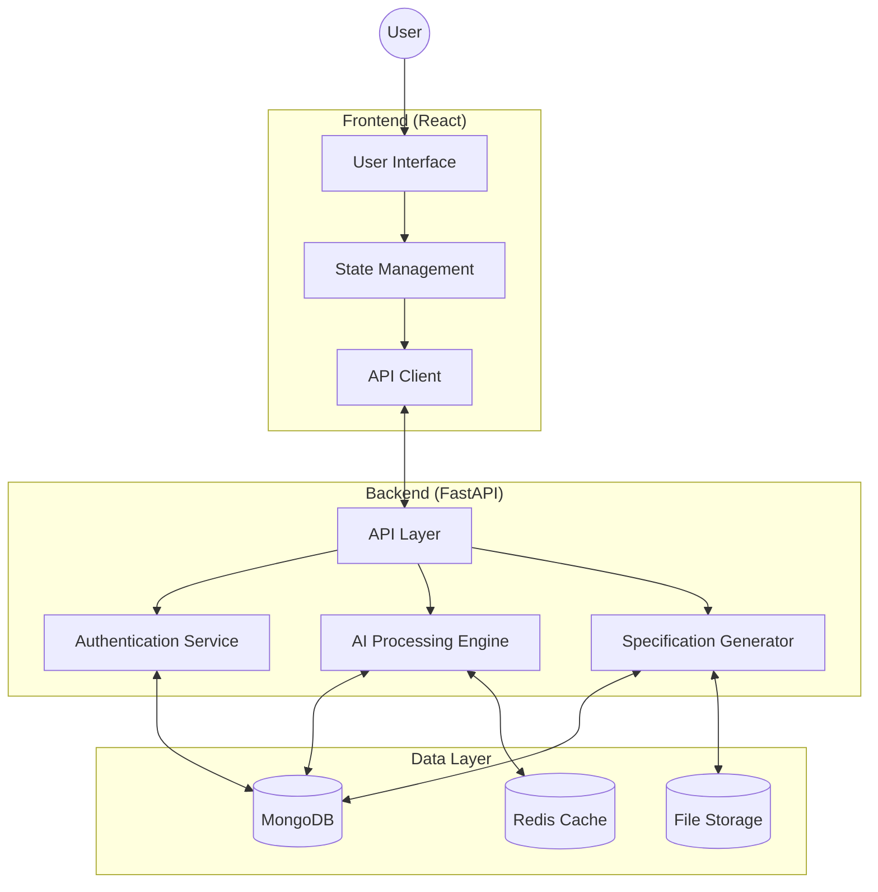
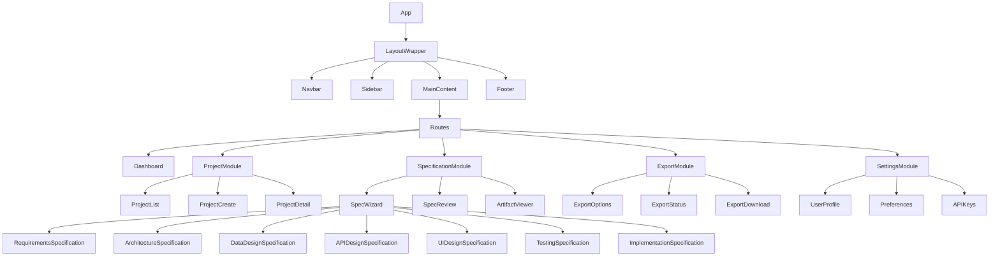
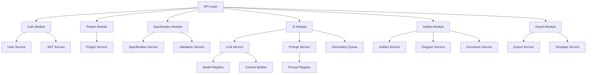
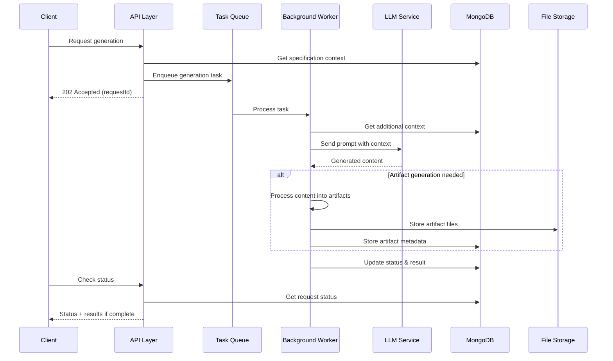
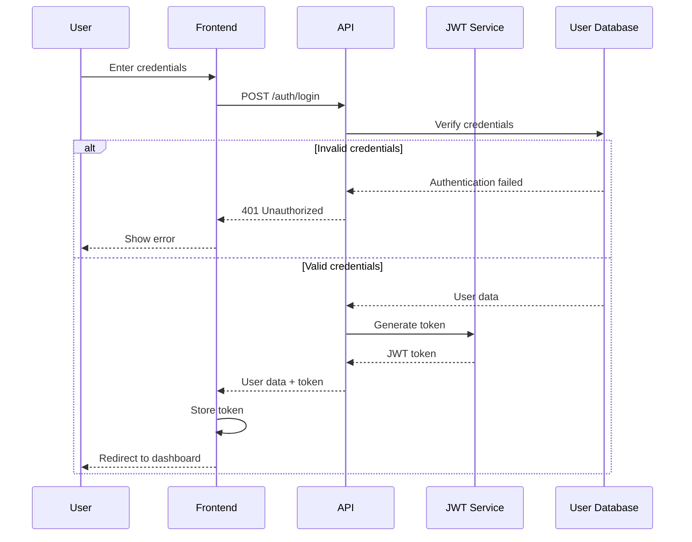
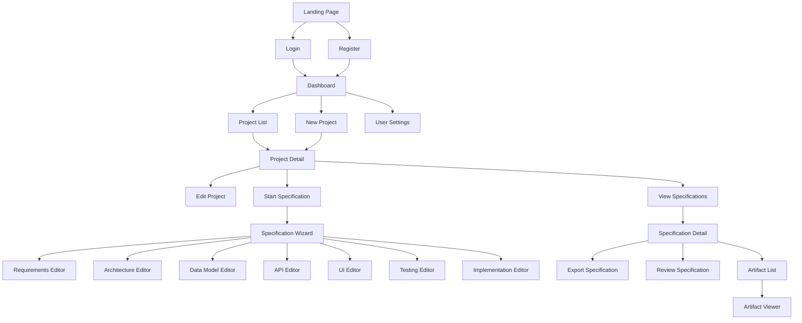
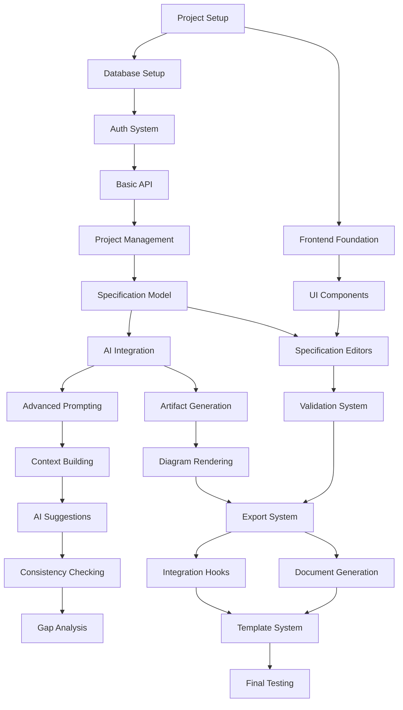
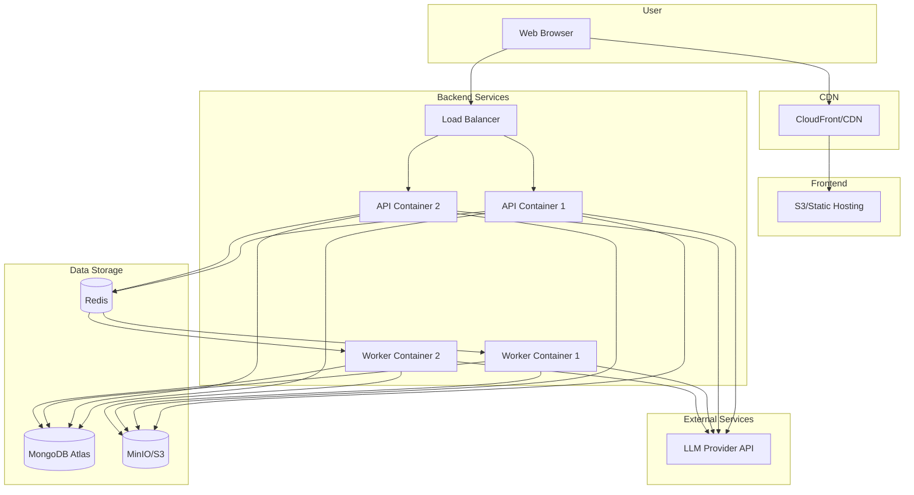
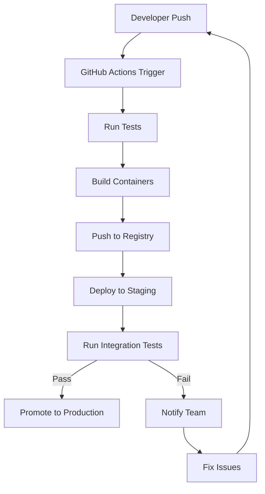

# ArchSpec Implementation Specification

**Project Name:** ArchSpec  
**Version:** 1.0.0  
**Generated Date:** March 7, 2025  
**Tech Stack:** React, Python (FastAPI), MongoDB, Redis, Docker

---

## Table of Contents

1. [System Architecture](#1-system-architecture)
2. [Database Design](#2-database-design)
3. [API Specification](#3-api-specification)
4. [Frontend Architecture](#4-frontend-architecture)
5. [Backend Architecture](#5-backend-architecture)
6. [Authentication & Authorization](#6-authentication--authorization)
7. [UI/UX Specification](#7-uiux-specification)
8. [Testing Strategy](#8-testing-strategy)
9. [Implementation Plan](#9-implementation-plan)
10. [Deployment Architecture](#10-deployment-architecture)

---

## 1. System Architecture

### 1.1 High-Level Architecture Diagram



### 1.2 System Components

| Component               | Purpose                       | Technology         | Description                                                                   |
| ----------------------- | ----------------------------- | ------------------ | ----------------------------------------------------------------------------- |
| User Interface          | Provides user interaction     | React, TypeScript  | Wizard-based UI for specification creation                                    |
| State Management        | Manages application state     | TanStack Query     | Data fetching and state management with automatic caching and synchronization |
| API Client              | Handles API communication     | Axios              | Wrapper for HTTP requests with interceptors for auth                          |
| API Layer               | Exposes backend functionality | FastAPI            | RESTful API endpoints for all system operations                               |
| AI Processing Engine    | Processes and generates specs | LangChain + OpenAI | Orchestrates AI operations for specification generation                       |
| Specification Generator | Creates spec artifacts        | Python + Jinja2    | Generates documentation, diagrams, and spec files                             |
| Authentication Service  | Handles user authentication   | JWT + OAuth2       | Manages user sessions and authorization                                       |
| MongoDB                 | Primary database              | MongoDB            | Stores user data, projects, and specifications                                |
| Redis Cache             | Caching layer                 | Redis              | Caches frequent operations and AI results                                     |
| File Storage            | Stores generated artifacts    | MinIO/S3           | Object storage for specification artifacts                                    |

### 1.3 Technology Selection Rationale

| Technology | Selection Justification                                                                                                       |
| ---------- | ----------------------------------------------------------------------------------------------------------------------------- |
| React      | Component-based architecture ideal for complex UI with reusable elements; large ecosystem; TypeScript support for type safety |
| FastAPI    | High-performance Python framework; automatic OpenAPI documentation; async support for AI operations                           |
| MongoDB    | Schema flexibility for evolving specification models; document-oriented structure matches specification artifacts             |
| Redis      | Low-latency caching for AI operations; pub/sub capabilities for real-time updates                                             |
| LangChain  | Framework for AI orchestration; simplifies prompt management and context handling                                             |
| MinIO/S3   | Object storage compatible with cloud deployment; versioning support for specification artifacts                               |

---

## 2. Database Design

### 2.1 MongoDB Collections Schema

#### 2.1.1 Users Collection

```json
{
  "_id": "ObjectId",
  "email": "string",
  "passwordHash": "string",
  "firstName": "string",
  "lastName": "string",
  "createdAt": "Date",
  "updatedAt": "Date",
  "lastLogin": "Date",
  "role": "string (enum: admin, user)",
  "preferences": {
    "theme": "string (enum: light, dark)",
    "defaultTechStack": "Object",
    "notifications": "Boolean"
  }
}
```

#### 2.1.2 Projects Collection

```json
{
  "_id": "ObjectId",
  "name": "string",
  "description": "string",
  "createdBy": "ObjectId (ref: Users)",
  "createdAt": "Date",
  "updatedAt": "Date",
  "status": "string (enum: draft, in-progress, completed)",
  "projectType": "string (enum: web, mobile, api, desktop)",
  "techStack": {
    "frontend": "string[]",
    "backend": "string[]",
    "database": "string[]",
    "deployment": "string[]"
  },
  "collaborators": [
    {
      "userId": "ObjectId (ref: Users)",
      "role": "string (enum: owner, editor, viewer)",
      "addedAt": "Date"
    }
  ],
  "tags": "string[]"
}
```

#### 2.1.3 Specifications Collection

```json
{
  "_id": "ObjectId",
  "projectId": "ObjectId (ref: Projects)",
  "version": "string (semver)",
  "createdAt": "Date",
  "updatedAt": "Date",
  "status": "string (enum: draft, in-progress, completed)",
  "completionPercentage": "number",
  "specs": {
    "requirements": {
      "status": "string (enum: not-started, in-progress, completed)",
      "data": "Object (requirements data model)",
      "completedAt": "Date"
    },
    "architecture": {
      "status": "string (enum: not-started, in-progress, completed)",
      "data": "Object (architecture data model)",
      "completedAt": "Date"
    },
    "dataDesign": {
      "status": "string (enum: not-started, in-progress, completed)",
      "data": "Object (data design model)",
      "completedAt": "Date"
    },
    "apiDesign": {
      "status": "string (enum: not-started, in-progress, completed)",
      "data": "Object (API design model)",
      "completedAt": "Date"
    },
    "uiDesign": {
      "status": "string (enum: not-started, in-progress, completed)",
      "data": "Object (UI design model)",
      "completedAt": "Date"
    },
    "testingFramework": {
      "status": "string (enum: not-started, in-progress, completed)",
      "data": "Object (testing framework model)",
      "completedAt": "Date"
    },
    "implementationPlan": {
      "status": "string (enum: not-started, in-progress, completed)",
      "data": "Object (implementation plan model)",
      "completedAt": "Date"
    }
  }
}
```

#### 2.1.4 Artifacts Collection

```json
{
  "_id": "ObjectId",
  "projectId": "ObjectId (ref: projects)",
  "type": "string (enum: diagram, document, schema, code)",
  "specification": "string (enum: requirements, architecture, ...)",
  "name": "string",
  "description": "string",
  "fileKey": "string (path in object storage)",
  "fileFormat": "string (enum: md, svg, json, yaml, etc.)",
  "createdAt": "Date",
  "updatedAt": "Date",
  "metadata": "Object (artifact-specific metadata)"
}
```

#### 2.1.5 AIModels Collection

```json
{
  "_id": "ObjectId",
  "name": "string",
  "provider": "string (enum: openai, anthropic, etc.)",
  "modelId": "string",
  "description": "string",
  "capabilities": "string[]",
  "defaultParameters": "Object",
  "active": "Boolean",
  "costPerToken": "number",
  "createdAt": "Date",
  "updatedAt": "Date"
}
```

### 2.2 Redis Schema

#### 2.2.1 Cache Keys

| Key Pattern                       | Purpose                         | TTL        | Data Structure |
| --------------------------------- | ------------------------------- | ---------- | -------------- |
| `user:{userId}:session`           | User session data               | 24 hours   | Hash           |
| `project:{projectId}:summary`     | Project summary data            | 1 hour     | Hash           |
| `spec:{specId}:status`            | Specification completion status | 10 minutes | String         |
| `ai:request:{requestId}:status`   | AI request status tracking      | 30 minutes | Hash           |
| `ai:prompt:{promptType}:template` | Cached prompt templates         | 24 hours   | String         |

---

## 3. API Specification

### 3.1 Base URL

```
/api/v1
```

### 3.2 Authentication Endpoints

#### 3.2.1 Register User

- **URL:** `/auth/register`
- **Method:** `POST`
- **Request Body:**
  ```json
  {
    "email": "string",
    "password": "string",
    "firstName": "string",
    "lastName": "string"
  }
  ```
- **Response:**
  ```json
  {
    "userId": "string",
    "email": "string",
    "firstName": "string",
    "lastName": "string",
    "createdAt": "string (ISO date)",
    "token": "string (JWT)"
  }
  ```
- **Status Codes:**
  - `201 Created` - Registration successful
  - `400 Bad Request` - Validation error
  - `409 Conflict` - Email already exists

#### 3.2.2 Login User

- **URL:** `/auth/login`
- **Method:** `POST`
- **Request Body:**
  ```json
  {
    "email": "string",
    "password": "string"
  }
  ```
- **Response:**
  ```json
  {
    "userId": "string",
    "email": "string",
    "firstName": "string",
    "lastName": "string",
    "token": "string (JWT)",
    "expiresAt": "string (ISO date)"
  }
  ```
- **Status Codes:**
  - `200 OK` - Login successful
  - `401 Unauthorized` - Invalid credentials

### 3.3 Project Endpoints

#### 3.3.1 Create Project

- **URL:** `/projects`
- **Method:** `POST`
- **Auth:** Required
- **Request Body:**
  ```json
  {
    "name": "string",
    "description": "string",
    "projectType": "string (enum: web, mobile, api, desktop)",
    "techStack": {
      "frontend": ["string"],
      "backend": ["string"],
      "database": ["string"],
      "deployment": ["string"]
    },
    "tags": ["string"]
  }
  ```
- **Response:**
  ```json
  {
    "projectId": "string",
    "name": "string",
    "description": "string",
    "createdAt": "string (ISO date)",
    "status": "string (draft)",
    "projectType": "string",
    "techStack": {
      "frontend": ["string"],
      "backend": ["string"],
      "database": ["string"],
      "deployment": ["string"]
    }
  }
  ```
- **Status Codes:**
  - `201 Created` - Project created
  - `400 Bad Request` - Validation error

#### 3.3.2 Get Project List

- **URL:** `/projects`
- **Method:** `GET`
- **Auth:** Required
- **Query Parameters:**
  - `status` (optional): Filter by status
  - `type` (optional): Filter by project type
  - `limit` (optional): Limit results
  - `offset` (optional): Pagination offset
- **Response:**
  ```json
  {
    "total": "number",
    "offset": "number",
    "limit": "number",
    "projects": [
      {
        "projectId": "string",
        "name": "string",
        "description": "string",
        "createdAt": "string (ISO date)",
        "updatedAt": "string (ISO date)",
        "status": "string",
        "projectType": "string",
        "completionPercentage": "number"
      }
    ]
  }
  ```
- **Status Codes:**
  - `200 OK` - Success

### 3.4 Specification Endpoints

#### 3.4.1 Create/Initialize Specification

- **URL:** `/projects/{projectId}/specs`
- **Method:** `POST`
- **Auth:** Required
- **Request Body:**
  ```json
  {
    "initialData": {
      "requirements": {
        "description": "string",
        "userStories": ["string"]
      },
      "techStack": {
        "frontend": ["string"],
        "backend": ["string"],
        "database": ["string"]
      }
    }
  }
  ```
- **Response:**
  ```json
  {
    "projectId": "string",
    "projectId": "string",
    "version": "string",
    "createdAt": "string (ISO date)",
    "status": "string (draft)",
    "specs": {
      "requirements": {
        "status": "string (in-progress)"
      },
      "architecture": {
        "status": "string (not-started)"
      },
      "dataDesign": {
        "status": "string (not-started)"
      },
      "apiDesign": {
        "status": "string (not-started)"
      },
      "uiDesign": {
        "status": "string (not-started)"
      },
      "testingFramework": {
        "status": "string (not-started)"
      },
      "implementationPlan": {
        "status": "string (not-started)"
      }
    }
  }
  ```
- **Status Codes:**
  - `201 Created` - Specification created
  - `400 Bad Request` - Validation error
  - `404 Not Found` - Project not found

#### 3.4.2 Update Specification

- **URL:** `/projects/{projectId}/specs/{specificationId}`
- **Method:** `PUT`
- **Auth:** Required
- **Request Body:**
  ```json
  {
    "data": "Object (specification-specific data model)",
    "status": "string (enum: in-progress, completed)"
  }
  ```
- **Response:**
  ```json
  {
    "projectId": "string",
    "specId": "string",
    "status": "string",
    "updatedAt": "string (ISO date)",
    "completionPercentage": "number"
  }
  ```
- **Status Codes:**
  - `200 OK` - Specification updated
  - `400 Bad Request` - Validation error
  - `404 Not Found` - Specification not found

### 3.5 AI Processing Endpoints

#### 3.5.1 Generate Section Content

- **URL:** `/ai/generate/specification/{projectId}/{specificationId}`
- **Method:** `POST`
- **Auth:** Required
- **Request Body:**
  ```json
  {
    "inputData": "Object (specification-specific data)",
    "generationOptions": {
      "detailLevel": "string (enum: high, medium, low)",
      "focus": ["string (aspects to focus on)"],
      "aiModel": "string (optional, model ID)"
    }
  }
  ```
- **Response:**
  ```json
  {
    "requestId": "string",
    "status": "string (processing)",
    "estimatedCompletionTime": "string (ISO date)"
  }
  ```
- **Status Codes:**
  - `202 Accepted` - Request accepted for processing
  - `400 Bad Request` - Validation error

#### 3.5.2 Check Generation Status

- **URL:** `/ai/status/{requestId}`
- **Method:** `GET`
- **Auth:** Required
- **Response:**
  ```json
  {
    "requestId": "string",
    "status": "string (enum: queued, processing, completed, failed)",
    "progress": "number (0-100)",
    "estimatedCompletionTime": "string (ISO date)",
    "result": {
      "artifacts": [
        {
          "artifactId": "string",
          "type": "string",
          "name": "string"
        }
      ],
      "specificationData": "Object (generated specification data)"
    }
  }
  ```
- **Status Codes:**
  - `200 OK` - Status retrieved
  - `404 Not Found` - Request not found

### 3.6 Artifact Endpoints

#### 3.6.1 Get Artifact

- **URL:** `/artifacts/{artifactId}`
- **Method:** `GET`
- **Auth:** Required
- **Response:** Binary file or JSON depending on artifact type
- **Status Codes:**
  - `200 OK` - Artifact retrieved
  - `404 Not Found` - Artifact not found

#### 3.6.2 Generate Artifact

- **URL:** `/artifacts/generate`
- **Method:** `POST`
- **Auth:** Required
- **Request Body:**
  ```json
  {
    "projectId": "string",
    "specification": "string",
    "type": "string (enum: diagram, document, schema, code)",
    "name": "string",
    "options": "Object (generation options)"
  }
  ```
- **Response:**
  ```json
  {
    "artifactId": "string",
    "name": "string",
    "type": "string",
    "fileFormat": "string",
    "createdAt": "string (ISO date)"
  }
  ```
- **Status Codes:**
  - `201 Created` - Artifact generated
  - `400 Bad Request` - Validation error

### 3.7 Export Endpoints

#### 3.7.1 Export Complete Project

- **URL:** `/export/project/{projectId}`
- **Method:** `POST`
- **Auth:** Required
- **Request Body:**
  ```json
  {
    "format": "string (enum: zip, pdf, markdown, html)",
    "specs": ["string (specification IDs to include)"],
    "includeArtifacts": "boolean"
  }
  ```
- **Response:**
  ```json
  {
    "exportId": "string",
    "status": "string (processing)",
    "estimatedCompletionTime": "string (ISO date)"
  }
  ```
- **Status Codes:**
  - `202 Accepted` - Export processing started
  - `400 Bad Request` - Validation error

#### 3.7.2 Get Export Result

- **URL:** `/export/result/{exportId}`
- **Method:** `GET`
- **Auth:** Required
- **Response:** Binary file (ZIP, PDF, etc.)
- **Status Codes:**
  - `200 OK` - Export retrieved
  - `202 Accepted` - Export still processing
  - `404 Not Found` - Export not found

---

## 4. Frontend Architecture

### 4.1 Component Structure



### 4.2 Directory Structure

```
/src
  /assets             # Static assets, images, etc.
  /components         # Reusable components
    /common           # Common UI components (buttons, forms, etc.)
    /layout           # Layout components (navbar, sidebar, etc.)
    /diagrams         # Diagram rendering components
    /editors          # Specialized editors for different project specifications
    /viewers          # Content and artifact viewers
  /context            # React context providers
  /hooks              # Custom React hooks
  /modules            # Feature modules
    /auth             # Authentication-related components
    /projects         # Project management components
    /specifications   # Specification creation and editing components
    /ai               # AI interaction components
    /export           # Export functionality components
    /settings         # User settings components
  /queries            # TanStack Query related files
    /auth             # Authentication queries and mutations
    /projects         # Project-related queries and mutations
    /specifications   # Specification-related queries and mutations
    /artifacts        # Artifact-related queries and mutations
    /ai               # AI service-related queries and mutations
  /services           # API client services
  /types              # TypeScript type definitions
  /utils              # Utility functions
  /config             # Configuration
  /routes             # Route definitions
  App.tsx             # Main application component
  index.tsx           # Application entry point
```

### 4.3 State Management

#### 4.3.1 TanStack Query Data Management

```typescript
// QueryClient configuration
const queryClient = new QueryClient({
  defaultOptions: {
    queries: {
      staleTime: 60000, // 1 minute
      cacheTime: 900000, // 15 minutes
      refetchOnWindowFocus: false,
      retry: 1,
    },
    mutations: {
      retry: 1,
    },
  },
});

// Example query hook for fetching a project
export function useProject(projectId: string) {
  return useQuery({
    queryKey: ["project", projectId],
    queryFn: () => api.getProject(projectId),
    enabled: !!projectId,
  });
}

// Example mutation hook for updating a project
export function useUpdateProject() {
  const queryClient = useQueryClient();

  return useMutation({
    mutationFn: (data: UpdateProjectDto) => api.updateProject(data),
    onSuccess: (result, variables) => {
      // Invalidate and refetch
      queryClient.invalidateQueries({
        queryKey: ["project", variables.projectId],
      });
      // Optimistic update for projects list
      queryClient.setQueryData(["projects"], (old: Project[] | undefined) =>
        old?.map((p) => (p.id === result.id ? result : p))
      );
    },
  });
}
```

#### 4.3.2 Key Query Categories

| Category                | Purpose              | Examples                                                       |
| ----------------------- | -------------------- | -------------------------------------------------------------- |
| `Auth Queries`          | Authentication state | `useUser`, `useLogin`, `useRegister`                           |
| `Project Queries`       | Project management   | `useProjects`, `useProject`, `useCreateProject`                |
| `Specification Queries` | Specification data   | `useSpecification`, `useSpecification`, `useSaveSpecification` |
| `Artifact Queries`      | Artifact management  | `useArtifacts`, `useArtifact`, `useGenerateArtifact`           |
| `AI Queries`            | AI operations        | `useGenerateContent`, `useRequestStatus`                       |
| `UI State`              | Local UI state       | `useThemePreference`, `useSidebarState`                        |

#### 4.3.3 Global State Management

For global UI state that doesn't fit the query/mutation model, a simple React Context is used:

```typescript
// UIContext.tsx
import React, { createContext, useContext, useState } from "react";

interface UIContextType {
  theme: "light" | "dark";
  setTheme: (theme: "light" | "dark") => void;
  sidebarOpen: boolean;
  toggleSidebar: () => void;
  notifications: Notification[];
  addNotification: (notification: Notification) => void;
  clearNotification: (id: string) => void;
}

const UIContext = createContext<UIContextType | undefined>(undefined);

export const UIProvider: React.FC<{ children: React.ReactNode }> = ({
  children,
}) => {
  const [theme, setTheme] = useState<"light" | "dark">("light");
  const [sidebarOpen, setSidebarOpen] = useState(true);
  const [notifications, setNotifications] = useState<Notification[]>([]);

  const toggleSidebar = () => setSidebarOpen(!sidebarOpen);

  const addNotification = (notification: Notification) => {
    setNotifications([...notifications, notification]);
  };

  const clearNotification = (id: string) => {
    setNotifications(notifications.filter((n) => n.id !== id));
  };

  return (
    <UIContext.Provider
      value={{
        theme,
        setTheme,
        sidebarOpen,
        toggleSidebar,
        notifications,
        addNotification,
        clearNotification,
      }}
    >
      {children}
    </UIContext.Provider>
  );
};

export const useUI = () => {
  const context = useContext(UIContext);
  if (context === undefined) {
    throw new Error("useUI must be used within a UIProvider");
  }
  return context;
};
```

### 4.4 Key Components

#### 4.4.1 SpecWizard Component

```typescript
interface SpecWizardProps {
  projectId: string;
  initialSpecification?: string;
  onComplete?: (projectId: string) => void;
}

// Component handles:
// 1. Navigation between project specifications
// 2. Tracking overall completion status
// 3. Coordinating AI-assisted content generation
// 4. Saving specification data
```

#### 4.4.2 ArtifactViewer Component

```typescript
interface ArtifactViewerProps {
  artifactId: string;
  type: "diagram" | "document" | "schema" | "code";
  editable?: boolean;
  onEdit?: (artifactId: string, content: any) => void;
}

// Component handles:
// 1. Rendering different artifact types
// 2. Optional editing capabilities
// 3. Download functionality
```

#### 4.4.3 DiagramRenderer Component

```typescript
interface DiagramRendererProps {
  type: "flowchart" | "sequence" | "class" | "entity-relationship";
  data: string; // Mermaid syntax
  title?: string;
  interactive?: boolean;
}

// Component handles:
// 1. Rendering Mermaid diagrams
// 2. Interactive zooming/panning
// 3. Export to SVG/PNG
```

---

## 5. Backend Architecture

### 5.1 Module Structure



### 5.2 Directory Structure

```
/app
  /main.py              # FastAPI application entry point
  /config               # Configuration management
    /__init__.py
    /settings.py        # Application settings
    /logging.py         # Logging configuration
  /api                  # API routes and controllers
    /__init__.py
    /auth.py            # Authentication routes
    /projects.py        # Project management routes
    /project_specs.py   # Specification routes
    /ai.py              # AI processing routes
    /artifacts.py       # Artifact management routes
    /export.py          # Export functionality routes
  /services             # Business logic services
    /__init__.py
    /auth_service.py    # Authentication services
    /user_service.py    # User management services
    /project_service.py # Project services
    /project_specs.py   # Specification services
    /llm_service.py     # LLM interaction services
    /prompt_service.py  # Prompt management services
    /artifact_service.py # Artifact generation services
    /export_service.py  # Export services
  /models               # Data models
    /__init__.py
    /user.py            # User related models
    /project.py         # Project models
    /specification.py   # Specification models
    /artifact.py        # Artifact models
    /ai.py              # AI request/response models
  /schemas              # Pydantic schemas for validation
    /__init__.py
    /auth.py            # Authentication schemas
    /project.py         # Project schemas
    /specification.py   # Specification schemas
    /artifact.py        # Artifact schemas
    /ai.py              # AI request/response schemas
  /core                 # Core functionality
    /__init__.py
    /security.py        # Security utilities
    /exceptions.py      # Custom exceptions
    /dependencies.py    # FastAPI dependencies
  /db                   # Database interaction
    /__init__.py
    /mongodb.py         # MongoDB client
    /redis.py           # Redis client
  /utils                # Utility functions
    /__init__.py
    /validators.py      # Validation utilities
    /templates.py       # Template utilities
    /file_storage.py    # File storage utilities
  /ai                   # AI processing modules
    /__init__.py
    /llm.py             # LLM client wrappers
    /prompts.py         # Prompt templates
    /processors.py      # Domain-specific AI processors
    /context.py         # Context building utilities
  /tasks                # Background tasks
    /__init__.py
    /worker.py          # Background worker setup
    /ai_tasks.py        # AI processing tasks
    /export_tasks.py    # Export processing tasks
```

### 5.3 Key Services

#### 5.3.1 LLM Service

```python
class LLMService:
    async def generate_content(
        self,
        prompt_template: str,
        context: dict,
        model_id: str = None,
        parameters: dict = None
    ) -> dict:
        """
        Generate content using specified LLM model

        Args:
            prompt_template: ID of prompt template to use
            context: Context data for prompt template
            model_id: Optional specific model to use
            parameters: Model-specific parameters

        Returns:
            Generated content with metadata
        """
        # Implementation details
```

#### 5.3.2 Specification Service

```python
class SpecificationService:
    async def create_specification(
        self,
        project_id: str,
        initial_data: dict = None
    ) -> dict:
        """
        Create a new specification for a project

        Args:
            project_id: Project ID
            initial_data: Optional initial specification data

        Returns:
            Created specification data
        """
        # Implementation details

    async def update_specification(
        self,
        project_id: str,
        spec_id: str,
        data: dict,
        status: str = None
    ) -> dict:
        """
        Update a specification of a project

        Args:
            project_id: Project ID
            spec_id: Specification ID
            data: Specification data
            status: Optional new status

        Returns:
            Updated specification info
        """
        # Implementation details
```

#### 5.3.3 Artifact Service

```python
class ArtifactService:
    async def generate_artifact(
        self,
        project_id: str,
        spec_id: str,
        artifact_type: str,
        name: str,
        options: dict = None
    ) -> dict:
        """
        Generate a new artifact

        Args:
            project_id: Project ID
            spec_id: Specification ID
            artifact_type: Type of artifact
            name: Artifact name
            options: Generation options

        Returns:
            Generated artifact metadata
        """
        # Implementation details

    async def get_artifact(
        self,
        artifact_id: str
    ) -> tuple:
        """
        Get artifact content

        Args:
            artifact_id: Artifact ID

        Returns:
            Tuple of (content, content_type)
        """
        # Implementation details
```

### 5.4 AI Processing Pipeline



---

## 6. Authentication & Authorization

### 6.1 Authentication Flow



### 6.2 Authorization Strategy

| Role                          | Permissions                                     |
| ----------------------------- | ----------------------------------------------- |
| Anonymous                     | Access landing page, register, login            |
| User                          | Create/edit own projects, export specifications |
| Project Collaborator (Editor) | Edit project specifications, generate artifacts |
| Project Collaborator (Viewer) | View project specifications, download artifacts |
| Admin                         | Manage all projects, users, and system settings |

### 6.3 JWT Implementation

```python
class JWTHandler:
    def create_access_token(
        self,
        user_id: str,
        expires_delta: timedelta = None
    ) -> str:
        """
        Create JWT access token

        Args:
            user_id: User ID
            expires_delta: Optional custom expiration

        Returns:
            JWT token string
        """
        # Implementation details

    def verify_token(
        self,
        token: str
    ) -> dict:
        """
        Verify and decode JWT token

        Args:
            token: JWT token string

        Returns:
            Decoded token payload
        """
        # Implementation details
```

---

## 7. UI/UX Specification

### 7.1 Site Map



### 7.2 Key Screens Wireframes

#### 7.2.1 Dashboard

```
+-------------------------------------------------------+
|  Logo   Dashboard Projects Settings Profile  [Logout] |
+-------------------------------------------------------+
|                                                       |
| +-------------------+  +-------------------------+    |
| | Recent Projects   |  | Specification Progress  |    |
| |                   |  |                         |    |
| | • Project A       |  | Project A: 75% complete |    |
| | • Project B       |  | Project B: 33% complete |    |
| | • Project C       |  |                         |    |
| |                   |  |                         |    |
| +-------------------+  +-------------------------+    |
|                                                       |
| +---------------------------------------------------+ |
| | Quick Actions                                     | |
| |                                                   | |
| | [New Project] [Resume Work] [Export Recent]       | |
| |                                                   | |
| +---------------------------------------------------+ |
|                                                       |
| +---------------------------------------------------+ |
| | Recent Activity                                   | |
| |                                                   | |
| | • Generated API specification for Project A       | |
| | • Updated data model for Project B                | |
| | • Exported specification for Project C            | |
| |                                                   | |
| +---------------------------------------------------+ |
|                                                       |
+-------------------------------------------------------+
```

#### 7.2.2 Specification Wizard - Architecture Section

```
+-------------------------------------------------------+
|  Logo   < Back to Project   AI Suggestions   [Save]   |
+-------------------------------------------------------+
|                                                       |
| Project: MyApp          Specification: v1.0           |
+-------------------------------------------------------+
|                      |                                |
| Requirements         |  Architecture Design           |
| Architecture         |                                |
| Data Design          |  Selected Pattern: Microservices|
| API Design           |                                |
| UI Design            |  [Edit Diagram]                |
| Testing              |                                |
| Implementation       |  +------------------------+    |
|                      |  |                        |    |
| Overall: 42%         |  |  Architecture Diagram  |    |
|                      |  |                        |    |
| [AI Generate]        |  +------------------------+    |
| [Preview]            |                                |
| [Export]             |  Components:                   |
|                      |                                |
|                      |  [+ Add Component]             |
|                      |                                |
|                      |  • User Service                |
|                      |    - Authentication            |
|                      |    - User Management           |
|                      |                                |
|                      |  • Content Service             |
|                      |    - Content Storage           |
|                      |    - Content Retrieval         |
|                      |                                |
|                      |                                |
+----------------------+--------------------------------+
```

#### 7.2.3 Artifact Viewer - API Specification

````
+-------------------------------------------------------+
|  Logo   < Back to Specification   [Download] [Share]  |
+-------------------------------------------------------+
|                                                       |
| API Specification - User Service                      |
+-------------------------------------------------------+
|                                                       |
| +---------------------------------------------------+ |
| | Endpoint: /api/users                              | |
| |                                                   | |
| | Methods:                                          | |
| | • GET - Retrieve users                            | |
| | • POST - Create user                              | |
| |                                                   | |
| | Parameters:                                       | |
| | • page (integer): Page number                     | |
| | • limit (integer): Results per page               | |
| |                                                   | |
| | Responses:                                        | |
| | • 200: Success                                    | |
| | • 400: Bad Request                                | |
| | • 401: Unauthorized                               | |
| | • 500: Server Error                               | |
| |                                                   | |
| | Example:                                          | |
| |                                                   | |
| | ```json                                           | |
| | {                                                 | |
| |   "users": [...],                                 | |
| |   "total": 42,                                    | |
| |   "page": 1                                       | |
| | }                                                 | |
| | ```                                               | |
| +---------------------------------------------------+ |
|                                                       |
+-------------------------------------------------------+
````

### 7.3 Color Palette

| Color          | Hex Code  | Usage                                   |
| -------------- | --------- | --------------------------------------- |
| Primary Blue   | `#2563EB` | Primary actions, buttons, links         |
| Secondary Teal | `#0D9488` | Secondary actions, highlights, accents  |
| Dark Gray      | `#1F2937` | Text, headers                           |
| Medium Gray    | `#6B7280` | Secondary text, icons                   |
| Light Gray     | `#F3F4F6` | Backgrounds, dividers                   |
| Success Green  | `#10B981` | Success messages, completion indicators |
| Warning Yellow | `#F59E0B` | Warnings, attention indicators          |
| Error Red      | `#EF4444` | Error messages, destructive actions     |
| White          | `#FFFFFF` | Backgrounds, text on dark colors        |

### 7.4 Typography

| Element          | Font      | Size | Weight         | Color                 |
| ---------------- | --------- | ---- | -------------- | --------------------- |
| Main Headings    | Inter     | 24px | Bold (700)     | Dark Gray (#1F2937)   |
| Section Headings | Inter     | 18px | SemiBold (600) | Dark Gray (#1F2937)   |
| Body Text        | Inter     | 14px | Regular (400)  | Dark Gray (#1F2937)   |
| Small Text       | Inter     | 12px | Regular (400)  | Medium Gray (#6B7280) |
| Buttons          | Inter     | 14px | Medium (500)   | White (#FFFFFF)       |
| Code             | Fira Code | 14px | Regular (400)  | Dark Gray (#1F2937)   |

---

## 8. Testing Strategy

### 8.1 Testing Levels

| Level               | Purpose                              | Tools                              | Coverage Target        |
| ------------------- | ------------------------------------ | ---------------------------------- | ---------------------- |
| Unit Testing        | Test individual functions/components | Python: pytest, JS: Jest           | 80% code coverage      |
| Integration Testing | Test component interactions          | pytest, Jest/React Testing Library | Key integration points |
| API Testing         | Test API endpoints                   | pytest, Postman                    | 100% endpoint coverage |
| End-to-End Testing  | Test complete user flows             | Cypress                            | Critical user journeys |
| Load Testing        | Test system under load               | Locust                             | Key API endpoints      |

### 8.2 Frontend Testing Plan

#### 8.2.1 Component Tests

```typescript
// Example component test for Specification component
describe("Specification", () => {
  it("renders section content when provided", () => {
    // Test implementation
  });

  it("shows loading state during content generation", () => {
    // Test implementation
  });

  it("displays error message when API call fails", () => {
    // Test implementation
  });

  it("calls update function when save button clicked", () => {
    // Test implementation
  });
});
```

#### 8.2.2 TanStack Query Tests

```typescript
// Example test for project query hooks
describe("projectQueries", () => {
  it("useProject returns project data on successful fetch", async () => {
    // Mock server response
    server.use(
      rest.get("/api/v1/projects/123", (req, res, ctx) => {
        return res(ctx.json({ id: "123", name: "Test Project" }));
      })
    );

    // Render hook
    const { result, waitFor } = renderHook(() => useProject("123"), {
      wrapper: QueryClientProvider,
      initialProps: {
        client: new QueryClient({
          defaultOptions: { queries: { retry: false } },
        }),
      },
    });

    // Wait for query to complete
    await waitFor(() => result.current.isSuccess);

    // Assertions
    expect(result.current.data).toEqual({ id: "123", name: "Test Project" });
  });

  it("useUpdateProject mutates and updates cache", async () => {
    // Setup test cache with initial data
    const queryClient = new QueryClient();
    queryClient.setQueryData(["projects"], [{ id: "123", name: "Old Name" }]);

    // Render mutation hook
    const { result, waitFor } = renderHook(() => useUpdateProject(), {
      wrapper: QueryClientProvider,
      initialProps: { client: queryClient },
    });

    // Setup mock response
    server.use(
      rest.put("/api/v1/projects/123", (req, res, ctx) => {
        return res(ctx.json({ id: "123", name: "New Name" }));
      })
    );

    // Execute mutation
    result.current.mutate({ projectId: "123", name: "New Name" });

    // Wait for mutation to complete
    await waitFor(() => result.current.isSuccess);

    // Verify cache was updated
    const cachedData = queryClient.getQueryData(["projects"]);
    expect(cachedData[0].name).toBe("New Name");
  });
});
```

### 8.3 Backend Testing Plan

#### 8.3.1 API Tests

```python
# Example API test for project creation
async def test_create_project():
    # Test setup
    project_data = {
        "name": "Test Project",
        "description": "Project for testing",
        "projectType": "web"
    }

    # Execute request
    response = await client.post(
        "/api/v1/projects",
        json=project_data,
        headers={"Authorization": f"Bearer {token}"}
    )

    # Assertions
    assert response.status_code == 201
    assert response.json()["name"] == project_data["name"]
    assert response.json()["description"] == project_data["description"]
    assert response.json()["projectType"] == project_data["projectType"]
    assert "projectId" in response.json()
```

#### 8.3.2 Service Tests

```python
# Example service test for specification service
async def test_specification_service_create():
    # Test setup
    project_id = "60a6c52e9f1b953a3a9b2d1f"
    initial_data = {
        "requirements": {
            "description": "Test description",
            "userStories": ["As a user, I want to login"]
        }
    }

    # Execute service method
    result = await specification_service.create_specification(
        project_id=project_id,
        initial_data=initial_data
    )

    # Assertions
    assert result["projectId"] == project_id
    assert result["status"] == "draft"
    assert result["specifications"]["requirements"]["status"] == "in-progress"
    assert "projectId" in result
```

### 8.4 AI Component Testing

#### 8.4.1 Prompt Testing Framework

```python
# Example prompt testing framework
class PromptTestCase:
    def __init__(self, prompt_id, context, expected_outputs=None):
        self.prompt_id = prompt_id
        self.context = context
        self.expected_outputs = expected_outputs or []

    async def execute(self, llm_service):
        result = await llm_service.generate_content(
            prompt_template=self.prompt_id,
            context=self.context
        )
        return self.validate(result)

    def validate(self, result):
        validation_results = []
        for expected in self.expected_outputs:
            if isinstance(expected, str) and expected in result["content"]:
                validation_results.append(True)
            elif callable(expected) and expected(result["content"]):
                validation_results.append(True)
            else:
                validation_results.append(False)
        return all(validation_results)
```

### 8.5 End-to-End Test Cases

1. **Complete Project Specification Flow**

   - Create new project
   - Initialize specification
   - Complete all specification forms
   - Generate artifacts for each specification
   - Export complete specification
   - Verify exported content

2. **AI-Assisted Specification Generation**

   - Create new project
   - Provide minimal information
   - Request AI to generate missing specifications
   - Review and modify AI suggestions
   - Finalize specification
   - Export specification

3. **Collaborative Specification Editing**
   - Create new project
   - Add collaborator
   - Simultaneously edit different specifications
   - Resolve any conflicts
   - Finalize specification
   - Verify changes by both users

---

## 9. Implementation Plan

### 9.1 Development Phases

#### 9.1.1 Phase 1: Core Infrastructure (Weeks 1-3)

| Task                | Description                                  | Priority | Estimated Effort |
| ------------------- | -------------------------------------------- | -------- | ---------------- |
| Project setup       | Initialize frontend and backend repos, CI/CD | High     | 3 days           |
| Database setup      | Configure MongoDB and Redis, create schemas  | High     | 2 days           |
| Auth system         | Implement user registration, login, JWT      | High     | 5 days           |
| Basic API           | Create core API endpoints structure          | High     | 4 days           |
| Project management  | Project CRUD operations                      | High     | 3 days           |
| Frontend foundation | Set up React app with routing and state      | High     | 5 days           |

#### 9.1.2 Phase 2: Specification Engine (Weeks 4-7)

| Task                  | Description                                   | Priority | Estimated Effort |
| --------------------- | --------------------------------------------- | -------- | ---------------- |
| Specification model   | Implement specification data model            | High     | 3 days           |
| Specification editors | Create UI for editing specifications          | High     | 8 days           |
| AI integration        | Connect to LLM API, implement prompt handling | High     | 5 days           |
| Artifact generation   | Create basic artifact generation system       | Medium   | 6 days           |
| Diagram rendering     | Implement Mermaid diagram rendering           | Medium   | 4 days           |
| Validation system     | Implement specification validation            | Medium   | 4 days           |

#### 9.1.3 Phase 3: AI Enhancement (Weeks 8-10)

| Task                 | Description                                   | Priority | Estimated Effort |
| -------------------- | --------------------------------------------- | -------- | ---------------- |
| Advanced prompting   | Improve prompt engineering for better results | High     | 5 days           |
| Context building     | Enhance context building for AI requests      | High     | 4 days           |
| AI suggestions       | Implement real-time AI suggestions            | Medium   | 6 days           |
| Consistency checking | Add AI-powered consistency validation         | Medium   | 5 days           |
| Gap analysis         | Implement missing information detection       | Medium   | 4 days           |

#### 9.1.4 Phase 4: Export and Integration (Weeks 11-12)

| Task                | Description                               | Priority | Estimated Effort |
| ------------------- | ----------------------------------------- | -------- | ---------------- |
| Export system       | Create specification export functionality | High     | 5 days           |
| Document generation | Generate comprehensive documentation      | High     | 4 days           |
| Integration hooks   | Create hooks for dev tool integration     | Medium   | 3 days           |
| Template system     | Implement customizable templates          | Medium   | 4 days           |
| Final testing       | End-to-end testing of complete system     | High     | 5 days           |

### 9.2 Dependency Graph



### 9.3 Technical Debt Mitigation

| Category      | Strategy                   | Implementation                                            |
| ------------- | -------------------------- | --------------------------------------------------------- |
| Code Quality  | Enforce code standards     | Set up ESLint, Prettier, Black, isort; require PR reviews |
| Test Coverage | Maintain high coverage     | Set up coverage reporting; fail builds below threshold    |
| Documentation | Keep docs current          | Document alongside code; automated doc generation         |
| Dependencies  | Manage vulnerabilities     | Regular dependency updates; security scanning             |
| Refactoring   | Identify refactoring needs | Regular code review sessions; refactoring sprints         |

---

## 10. Deployment Architecture

### 10.1 Infrastructure Diagram



### 10.2 Container Configuration

#### 10.2.1 API Container (Dockerfile)

```dockerfile
FROM python:3.10-slim

WORKDIR /app

COPY requirements.txt .
RUN pip install --no-cache-dir -r requirements.txt

COPY . .

CMD ["uvicorn", "app.main:app", "--host", "0.0.0.0", "--port", "8000"]
```

#### 10.2.2 Worker Container (Dockerfile)

```dockerfile
FROM python:3.10-slim

WORKDIR /app

COPY requirements.txt .
RUN pip install --no-cache-dir -r requirements.txt

COPY . .

CMD ["python", "-m", "app.tasks.worker"]
```

### 10.3 Scaling Strategy

| Component      | Scaling Approach      | Metrics                                       | Thresholds                   |
| -------------- | --------------------- | --------------------------------------------- | ---------------------------- |
| API Service    | Horizontal scaling    | CPU >70%, Memory >80%, Request latency >500ms | Min: 2, Max: 10 instances    |
| Worker Service | Horizontal scaling    | Queue depth >100, CPU >70%                    | Min: 2, Max: 8 instances     |
| MongoDB        | Vertical + Horizontal | Storage >70%, Read/write latency >50ms        | Automatic scaling with Atlas |
| Redis          | Cluster + Replicas    | Memory >70%, Connections >5000                | Min: 3 nodes                 |

### 10.4 CI/CD Pipeline



### 10.5 Monitoring & Observability

| Component      | Tool                     | Metrics/Logs                              | Alerts                                 |
| -------------- | ------------------------ | ----------------------------------------- | -------------------------------------- |
| API Service    | Prometheus, Grafana      | Request rate, latency, errors             | Error rate >1%, P95 latency >1s        |
| Worker Service | Prometheus, Grafana      | Queue depth, processing time              | Queue depth >200, job failures         |
| MongoDB        | MongoDB Atlas Monitoring | Query performance, connection count       | Slow queries, high connection count    |
| Redis          | Redis Insights           | Memory usage, hit rate                    | Memory >80%, eviction rate high        |
| LLM Service    | Custom metrics           | Request count, response time, token usage | Failed requests >5%, response time >5s |
| Frontend       | Google Analytics, Sentry | Page load time, error tracking            | JS errors, slow page loads             |
