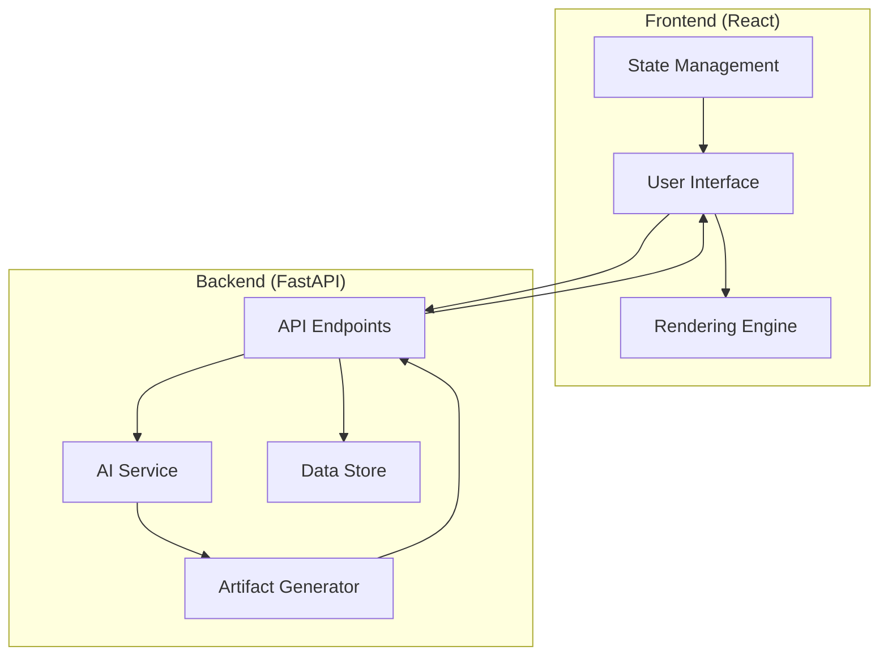
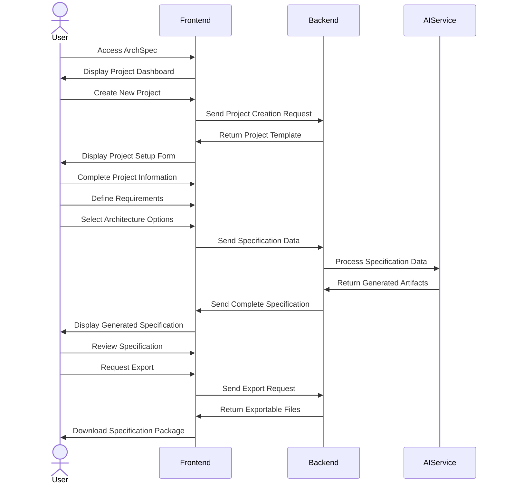
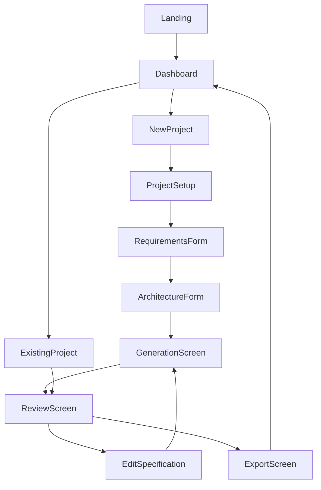
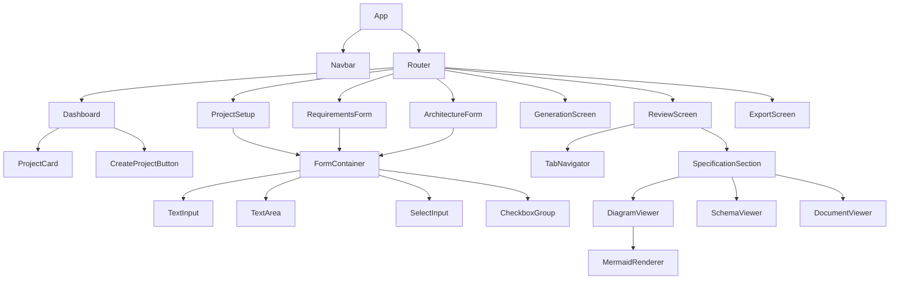

# ArchSpec Bootstrap Specification (v0.1)

## 1. Project Overview

**Project Name:** ArchSpec (Bootstrap Version 0.1)  
**Description:** An AI-driven software specification system that creates detailed implementation plans before writing any code.  
**Tech Stack:** React (Frontend), Python/FastAPI (Backend)  
**Target Completion:** Minimal viable implementation for self-improvement iteration

### 1.1 System Architecture



### 1.2 Core Features (Bootstrap Version)

1. **Project Management**
   - Create and manage specification projects
   - Single preset template for web applications
   - Basic project metadata management

2. **Specification Workflow**
   - Guided form-based input for requirements
   - Simple questionnaire for architectural decisions
   - Basic validation of inputs

3. **Artifact Generation**
   - System architecture diagram
   - API endpoint specifications
   - Data model definitions
   - Implementation file structure

4. **Export Capability**
   - Export specifications as Markdown
   - Simple file-based download

## 2. User Flow

### 2.1 Core User Journey



### 2.2 Screen Flow



## 3. Data Models

### 3.1 Project

```json
{
  "id": "string (UUID)",
  "name": "string",
  "description": "string",
  "created_at": "datetime",
  "updated_at": "datetime",
  "template_type": "string (default: web_app)",
  "status": "string (draft, in_progress, completed)",
  "metadata": {
    "version": "string",
    "author": "string"
  }
}
```

### 3.2 Specification

```json
{
  "id": "string (UUID)",
  "project_id": "string (UUID)",
  "requirements": {
    "project_type": "string",
    "functional_requirements": ["string"],
    "non_functional_requirements": ["string"],
    "tech_stack": {
      "frontend": "string",
      "backend": "string",
      "database": "string"
    }
  },
  "architecture": {
    "pattern": "string",
    "components": ["string"],
    "data_flow": ["string"]
  },
  "data_model": {
    "entities": [
      {
        "name": "string",
        "attributes": [
          {
            "name": "string",
            "type": "string",
            "constraints": ["string"]
          }
        ],
        "relationships": ["string"]
      }
    ]
  },
  "api_endpoints": [
    {
      "path": "string",
      "method": "string",
      "request_body": "json_schema",
      "response": "json_schema",
      "description": "string"
    }
  ],
  "implementation": {
    "file_structure": ["string"],
    "key_components": ["string"]
  },
  "created_at": "datetime",
  "updated_at": "datetime"
}
```

### 3.3 Artifact

```json
{
  "id": "string (UUID)",
  "specification_id": "string (UUID)",
  "type": "string (diagram, schema, document)",
  "format": "string (mermaid, json, markdown)",
  "content": "string",
  "created_at": "datetime"
}
```

## 4. API Endpoints

### 4.1 Projects API

| Endpoint | Method | Description | Request Body | Response |
|----------|--------|-------------|--------------|----------|
| `/api/projects` | GET | List all projects | - | Array of Project objects |
| `/api/projects` | POST | Create new project | Project data | Project object |
| `/api/projects/{id}` | GET | Get project details | - | Project object |
| `/api/projects/{id}` | PUT | Update project | Project data | Project object |
| `/api/projects/{id}` | DELETE | Delete project | - | Success message |

### 4.2 Specifications API

| Endpoint | Method | Description | Request Body | Response |
|----------|--------|-------------|--------------|----------|
| `/api/projects/{id}/specification` | GET | Get project specification | - | Specification object |
| `/api/projects/{id}/specification` | POST | Create/update specification | Specification data | Specification object |
| `/api/projects/{id}/specification/generate` | POST | Generate artifacts | - | Array of generated Artifact objects |

### 4.3 Export API

| Endpoint | Method | Description | Request Body | Response |
|----------|--------|-------------|--------------|----------|
| `/api/projects/{id}/export` | GET | Export project specification | - | ZIP file download |

## 5. Frontend Components

### 5.1 Page Components

#### Dashboard Page
- Project list with status indicators
- New project button
- Project search/filter

#### Project Setup Page
- Project name and description inputs
- Template selection (limited to web app in v0.1)
- Next step button

#### Requirements Form Page
- Functional requirements input
- Non-functional requirements input 
- Tech stack selection
- Basic validation

#### Architecture Form Page
- Architecture pattern selection
- Component definition inputs
- Data flow description inputs

#### Generation Screen
- Loading indicator
- Generation status updates
- Preview of generated artifacts

#### Review Screen
- Tabbed interface for specification sections
- Edit buttons for each section
- Export button

#### Export Screen
- Export format options
- Download button
- Return to dashboard option

### 5.2 Component Hierarchy



## 6. Implementation Plan

### 6.1 File Structure

```
archspec/
├── frontend/
│   ├── public/
│   ├── src/
│   │   ├── assets/
│   │   ├── components/
│   │   │   ├── common/
│   │   │   ├── dashboard/
│   │   │   ├── forms/
│   │   │   ├── review/
│   │   │   └── export/
│   │   ├── pages/
│   │   ├── services/
│   │   ├── utils/
│   │   ├── App.js
│   │   ├── index.js
│   │   └── router.js
│   ├── package.json
│   └── vite.config.js
├── backend/
│   ├── app/
│   │   ├── api/
│   │   │   ├── routes/
│   │   │   │   ├── projects.py
│   │   │   │   ├── specifications.py
│   │   │   │   └── export.py
│   │   │   └── api.py
│   │   ├── core/
│   │   │   ├── config.py
│   │   │   └── security.py
│   │   ├── db/
│   │   │   ├── base.py
│   │   │   └── models.py
│   │   ├── schemas/
│   │   │   ├── project.py
│   │   │   ├── specification.py
│   │   │   └── artifact.py
│   │   ├── services/
│   │   │   ├── ai_service.py
│   │   │   ├── generator_service.py
│   │   │   └── export_service.py
│   │   └── main.py
│   ├── tests/
│   │   ├── api/
│   │   └── services/
│   ├── requirements.txt
│   └── Dockerfile
├── docker-compose.yml
└── README.md
```

### 6.2 Key Implementation Components

#### 6.2.1 Frontend Implementation

**App.js**
```javascript
import React from 'react';
import { BrowserRouter as Router } from 'react-router-dom';
import AppRoutes from './router';
import Navbar from './components/common/Navbar';

function App() {
  return (
    <Router>
      <div className="app-container">
        <Navbar />
        <main className="main-content">
          <AppRoutes />
        </main>
      </div>
    </Router>
  );
}

export default App;
```

**services/api.js**
```javascript
import axios from 'axios';

const API_BASE_URL = process.env.REACT_APP_API_URL || 'http://localhost:8000/api';

const apiClient = axios.create({
  baseURL: API_BASE_URL,
  headers: {
    'Content-Type': 'application/json',
  },
});

export const projectService = {
  getProjects: () => apiClient.get('/projects'),
  createProject: (projectData) => apiClient.post('/projects', projectData),
  getProject: (id) => apiClient.get(`/projects/${id}`),
  updateProject: (id, projectData) => apiClient.put(`/projects/${id}`, projectData),
  deleteProject: (id) => apiClient.delete(`/projects/${id}`),
};

export const specificationService = {
  getSpecification: (projectId) => apiClient.get(`/projects/${projectId}/specification`),
  updateSpecification: (projectId, specData) => apiClient.post(`/projects/${projectId}/specification`, specData),
  generateArtifacts: (projectId) => apiClient.post(`/projects/${projectId}/specification/generate`),
};

export const exportService = {
  exportProject: (projectId) => apiClient.get(`/projects/${projectId}/export`, {
    responseType: 'blob',
  }),
};
```

**components/review/DiagramViewer.js**
```javascript
import React, { useEffect, useRef } from 'react';
import mermaid from 'mermaid';

const DiagramViewer = ({ content, type }) => {
  const containerRef = useRef(null);

  useEffect(() => {
    if (containerRef.current && type === 'mermaid') {
      mermaid.initialize({
        startOnLoad: true,
        theme: 'default',
      });
      
      mermaid.render('diagram', content, (svg) => {
        containerRef.current.innerHTML = svg;
      });
    }
  }, [content, type]);

  return (
    <div className="diagram-container">
      <div ref={containerRef} className="mermaid-diagram"></div>
    </div>
  );
};

export default DiagramViewer;
```

#### 6.2.2 Backend Implementation

**app/main.py**
```python
from fastapi import FastAPI
from fastapi.middleware.cors import CORSMiddleware
from app.api.api import api_router
from app.core.config import settings

app = FastAPI(title="ArchSpec API", version="0.1.0")

# CORS
app.add_middleware(
    CORSMiddleware,
    allow_origins=settings.CORS_ORIGINS,
    allow_credentials=True,
    allow_methods=["*"],
    allow_headers=["*"],
)

app.include_router(api_router, prefix="/api")

@app.get("/health")
def health_check():
    return {"status": "healthy"}
```

**app/services/ai_service.py**
```python
import os
from typing import Dict, Any, List
import json
import openai
from app.core.config import settings

class AIService:
    def __init__(self):
        openai.api_key = settings.OPENAI_API_KEY
        
    async def process_specification(self, spec_data: Dict[str, Any]) -> Dict[str, Any]:
        """
        Process the specification data using OpenAI to enhance and fill gaps
        """
        try:
            # For bootstrap version, we'll use a simplified approach
            # In future versions, this will use more sophisticated prompting
            prompt = self._generate_prompt(spec_data)
            
            response = await openai.chat.completions.create(
                model="gpt-4-turbo",
                messages=[
                    {"role": "system", "content": "You are ArchSpec, an AI software architect. Generate detailed software specifications based on requirements."},
                    {"role": "user", "content": prompt}
                ],
                temperature=0.7,
            )
            
            # Extract and parse the AI-generated content
            ai_content = response.choices[0].message.content
            return self._parse_ai_content(ai_content, spec_data)
            
        except Exception as e:
            print(f"Error in AI processing: {str(e)}")
            # Return original spec data if AI processing fails
            return spec_data
    
    def _generate_prompt(self, spec_data: Dict[str, Any]) -> str:
        """Generate a prompt for the AI based on specification data"""
        # A simplified prompt for the bootstrap version
        prompt = f"""
        Based on the following software specification:
        
        Project Type: {spec_data.get('requirements', {}).get('project_type', 'Web Application')}
        
        Functional Requirements:
        {json.dumps(spec_data.get('requirements', {}).get('functional_requirements', []), indent=2)}
        
        Non-Functional Requirements:
        {json.dumps(spec_data.get('requirements', {}).get('non_functional_requirements', []), indent=2)}
        
        Tech Stack:
        {json.dumps(spec_data.get('requirements', {}).get('tech_stack', {}), indent=2)}
        
        Please generate:
        
        1. A system architecture diagram in Mermaid syntax
        2. A list of API endpoints with their methods, inputs, and outputs
        3. Data models for the key entities in the system
        4. A recommended file structure for implementation
        
        Format the output as JSON with the following structure:
        {{
            "architecture_diagram": "mermaid syntax here",
            "api_endpoints": [...],
            "data_models": [...],
            "file_structure": [...]
        }}
        """
        return prompt
    
    def _parse_ai_content(self, ai_content: str, original_spec: Dict[str, Any]) -> Dict[str, Any]:
        """Parse the AI-generated content and integrate with original spec"""
        try:
            # Extract JSON content from the AI response
            json_start = ai_content.find('{')
            json_end = ai_content.rfind('}')
            
            if json_start != -1 and json_end != -1:
                json_content = ai_content[json_start:json_end+1]
                ai_data = json.loads(json_content)
                
                # Merge with original spec
                enhanced_spec = original_spec.copy()
                
                # Add AI-generated content
                if 'architecture_diagram' in ai_data:
                    enhanced_spec['architecture'] = enhanced_spec.get('architecture', {})
                    enhanced_spec['architecture']['diagram'] = ai_data['architecture_diagram']
                
                if 'api_endpoints' in ai_data:
                    enhanced_spec['api_endpoints'] = ai_data['api_endpoints']
                
                if 'data_models' in ai_data:
                    enhanced_spec['data_model'] = enhanced_spec.get('data_model', {})
                    enhanced_spec['data_model']['entities'] = ai_data['data_models']
                
                if 'file_structure' in ai_data:
                    enhanced_spec['implementation'] = enhanced_spec.get('implementation', {})
                    enhanced_spec['implementation']['file_structure'] = ai_data['file_structure']
                
                return enhanced_spec
            
            return original_spec
            
        except Exception as e:
            print(f"Error parsing AI content: {str(e)}")
            return original_spec
```

**app/services/generator_service.py**
```python
from typing import Dict, Any, List
from app.schemas.artifact import ArtifactCreate
import uuid

class GeneratorService:
    """Service for generating artifacts from specifications"""
    
    async def generate_artifacts(self, specification: Dict[str, Any]) -> List[Dict[str, Any]]:
        """Generate artifacts from a specification"""
        artifacts = []
        
        # Generate architecture diagram
        if specification.get('architecture', {}).get('diagram'):
            artifacts.append(
                ArtifactCreate(
                    id=str(uuid.uuid4()),
                    specification_id=specification.get('id'),
                    type="diagram",
                    format="mermaid",
                    content=specification['architecture']['diagram']
                ).dict()
            )
        
        # Generate data model schema
        if specification.get('data_model', {}).get('entities'):
            artifacts.append(
                ArtifactCreate(
                    id=str(uuid.uuid4()),
                    specification_id=specification.get('id'),
                    type="schema",
                    format="json",
                    content=str(specification['data_model'])
                ).dict()
            )
        
        # Generate API documentation
        if specification.get('api_endpoints'):
            api_doc = self._generate_api_doc(specification['api_endpoints'])
            artifacts.append(
                ArtifactCreate(
                    id=str(uuid.uuid4()),
                    specification_id=specification.get('id'),
                    type="document",
                    format="markdown",
                    content=api_doc
                ).dict()
            )
        
        # Generate implementation plan
        if specification.get('implementation', {}).get('file_structure'):
            impl_doc = self._generate_implementation_doc(specification['implementation'])
            artifacts.append(
                ArtifactCreate(
                    id=str(uuid.uuid4()),
                    specification_id=specification.get('id'),
                    type="document",
                    format="markdown",
                    content=impl_doc
                ).dict()
            )
        
        return artifacts
    
    def _generate_api_doc(self, api_endpoints: List[Dict[str, Any]]) -> str:
        """Generate API documentation in markdown format"""
        doc = "# API Documentation\n\n"
        
        for endpoint in api_endpoints:
            doc += f"## {endpoint.get('path', 'Unknown Endpoint')}\n\n"
            doc += f"**Method:** {endpoint.get('method', 'GET')}\n\n"
            doc += f"**Description:** {endpoint.get('description', '')}\n\n"
            
            if endpoint.get('request_body'):
                doc += "**Request Body:**\n\n```json\n"
                doc += f"{endpoint['request_body']}\n```\n\n"
            
            if endpoint.get('response'):
                doc += "**Response:**\n\n```json\n"
                doc += f"{endpoint['response']}\n```\n\n"
            
            doc += "---\n\n"
        
        return doc
    
    def _generate_implementation_doc(self, implementation: Dict[str, Any]) -> str:
        """Generate implementation documentation in markdown format"""
        doc = "# Implementation Plan\n\n"
        
        doc += "## File Structure\n\n```\n"
        for file in implementation.get('file_structure', []):
            doc += f"{file}\n"
        doc += "```\n\n"
        
        if implementation.get('key_components'):
            doc += "## Key Components\n\n"
            for component in implementation['key_components']:
                doc += f"- {component}\n"
        
        return doc
```

## 7. Test Specifications

### 7.1 Backend Tests

#### 7.1.1 API Tests

**tests/api/test_projects.py**
```python
from fastapi.testclient import TestClient
import pytest
from app.main import app

client = TestClient(app)

def test_create_project():
    """Test creating a new project"""
    response = client.post(
        "/api/projects",
        json={
            "name": "Test Project",
            "description": "A test project",
            "template_type": "web_app"
        }
    )
    assert response.status_code == 200
    data = response.json()
    assert data["name"] == "Test Project"
    assert "id" in data

def test_get_project():
    """Test retrieving a project"""
    # First create a project
    create_response = client.post(
        "/api/projects",
        json={
            "name": "Project to Retrieve",
            "description": "Project for get test",
            "template_type": "web_app"
        }
    )
    project_id = create_response.json()["id"]
    
    # Now retrieve it
    response = client.get(f"/api/projects/{project_id}")
    assert response.status_code == 200
    data = response.json()
    assert data["id"] == project_id
    assert data["name"] == "Project to Retrieve"
```

#### 7.1.2 Service Tests

**tests/services/test_generator_service.py**
```python
import pytest
from app.services.generator_service import GeneratorService

@pytest.fixture
def generator_service():
    return GeneratorService()

@pytest.fixture
def sample_specification():
    return {
        "id": "test-spec-id",
        "architecture": {
            "diagram": "graph TD\n    A-->B"
        },
        "data_model": {
            "entities": [
                {
                    "name": "User",
                    "attributes": [
                        {"name": "id", "type": "string", "constraints": ["primary_key"]}
                    ]
                }
            ]
        },
        "api_endpoints": [
            {
                "path": "/api/users",
                "method": "GET",
                "description": "Get all users",
                "response": "{\"users\": []}"
            }
        ],
        "implementation": {
            "file_structure": [
                "src/",
                "src/components/",
                "src/pages/"
            ]
        }
    }

@pytest.mark.asyncio
async def test_generate_artifacts(generator_service, sample_specification):
    """Test generating artifacts from a specification"""
    artifacts = await generator_service.generate_artifacts(sample_specification)
    
    # Should have 4 artifacts (diagram, schema, api doc, implementation doc)
    assert len(artifacts) == 4
    
    # Check for diagram artifact
    diagram = next((a for a in artifacts if a["type"] == "diagram"), None)
    assert diagram is not None
    assert diagram["format"] == "mermaid"
    assert "graph TD" in diagram["content"]
    
    # Check for API doc
    api_doc = next((a for a in artifacts if a["type"] == "document" and "API Documentation" in a["content"]), None)
    assert api_doc is not None
    assert "/api/users" in api_doc["content"]
```

### 7.2 Frontend Tests

**src/components/common/Navbar.test.js**
```javascript
import React from 'react';
import { render, screen } from '@testing-library/react';
import { BrowserRouter } from 'react-router-dom';
import Navbar from './Navbar';

test('renders navbar with project title', () => {
  render(
    <BrowserRouter>
      <Navbar />
    </BrowserRouter>
  );
  
  const titleElement = screen.getByText(/ArchSpec/i);
  expect(titleElement).toBeInTheDocument();
});

test('renders navigation links', () => {
  render(
    <BrowserRouter>
      <Navbar />
    </BrowserRouter>
  );
  
  const dashboardLink = screen.getByText(/Dashboard/i);
  expect(dashboardLink).toBeInTheDocument();
});
```

**src/pages/Dashboard.test.js**
```javascript
import React from 'react';
import { render, screen, waitFor } from '@testing-library/react';
import { BrowserRouter } from 'react-router-dom';
import Dashboard from './Dashboard';
import { projectService } from '../services/api';

// Mock the API service
jest.mock('../services/api', () => ({
  projectService: {
    getProjects: jest.fn()
  }
}));

test('renders loading state initially', () => {
  projectService.getProjects.mockResolvedValue({ data: [] });
  
  render(
    <BrowserRouter>
      <Dashboard />
    </BrowserRouter>
  );
  
  const loadingElement = screen.getByText(/Loading/i);
  expect(loadingElement).toBeInTheDocument();
});

test('renders projects when loaded', async () => {
  const mockProjects = [
    { id: '1', name: 'Test Project 1', status: 'draft' },
    { id: '2', name: 'Test Project 2', status: 'completed' }
  ];
  
  projectService.getProjects.mockResolvedValue({ data: mockProjects });
  
  render(
    <BrowserRouter>
      <Dashboard />
    </BrowserRouter>
  );
  
  await waitFor(() => {
    expect(screen.getByText(/Test Project 1/i)).toBeInTheDocument();
    expect(screen.getByText(/Test Project 2/i)).toBeInTheDocument();
  });
});
```

## 8. Development Setup Guide

### 8.1 Prerequisites

- Node.js 18.x or higher
- Python 3.9 or higher
- Docker and Docker Compose (optional)

### 8.2 Frontend Setup

```bash
# Clone the repository
git clone https://github.com/your-username/archspec.git
cd archspec/frontend

# Install dependencies
npm install

# Start development server
npm run dev
```

### 8.3 Backend Setup

```bash
# Navigate to backend directory
cd ../backend

# Create a virtual environment
python -m venv venv
source venv/bin/activate  # On Windows: venv\Scripts\activate

# Install dependencies
pip install -r requirements.txt

# Set up environment variables
export OPENAI_API_KEY=your_openai_api_key  # On Windows: set OPENAI_API_KEY=your_openai_api_key

# Start the development server
uvicorn app.main:app --reload
```

### 8.4 Docker Setup

```bash
# Start both frontend and backend
docker-compose up -d

# View logs
docker-compose logs -f
```

## 9. Roadmap for Incremental Development

### Version 0.1 (Bootstrap)
- Basic project management
- Single project template (web app)
- Simple form-based specification input
- Basic artifact generation
- Markdown export

### Version 0.2
- Multiple project templates
- Enhanced AI integration
- More detailed architecture options
- Improved artifact generation quality
- JSON export option

### Version 0.3
- User authentication and accounts
- Project history and versioning
- Rich text editing for requirements
- Custom template creation
- PDF export option

### Version 0.4
- Advanced validation and consistency checking
- Integration with external tools
- Team collaboration features
- Real-time preview updates
- Enhanced visualization options

## 10. Conclusion

This bootstrap specification provides a minimal yet functional implementation of ArchSpec that can be used to create its own future iterations. By focusing on core functionality first, this approach allows for a working system that can be incrementally improved using its own output.

The implementation is designed to be modular, with clear separation of concerns between frontend, backend, and AI services, allowing for independent development and scaling of each component.
